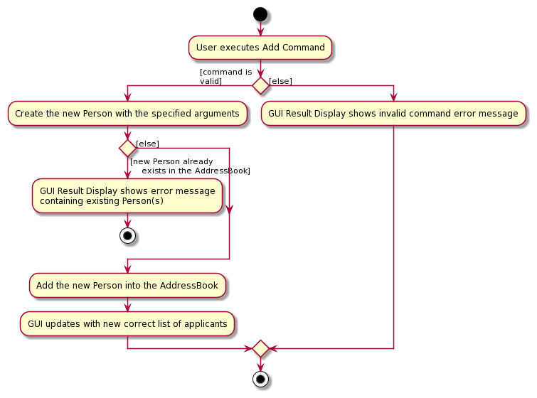
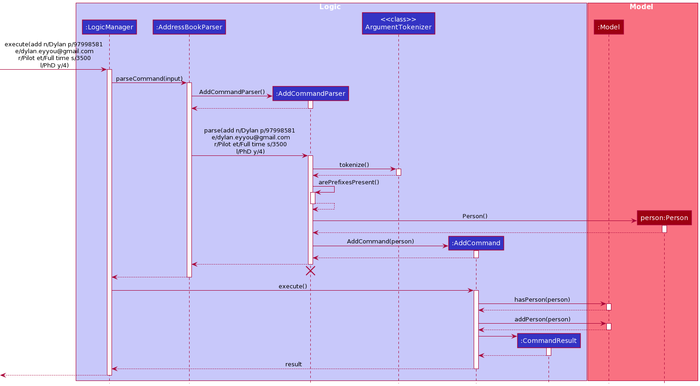
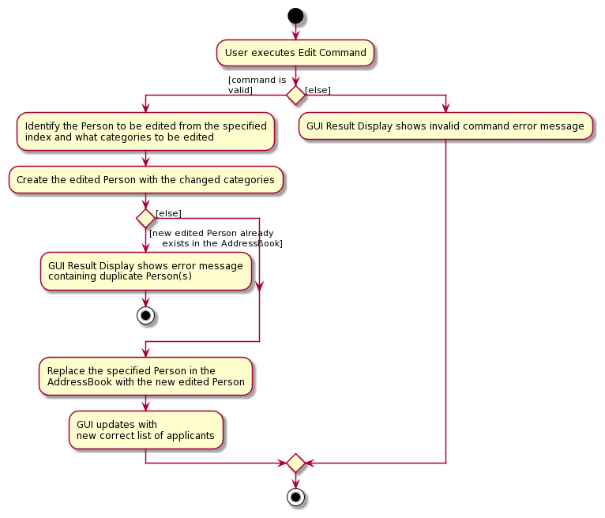
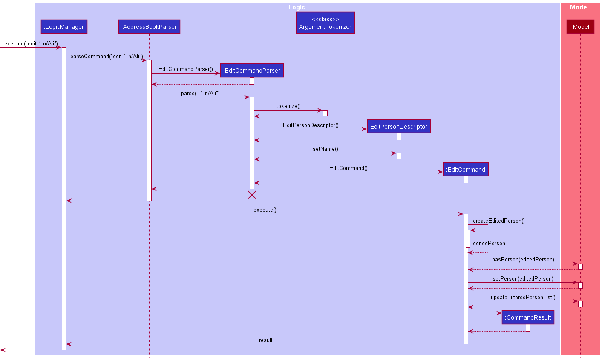
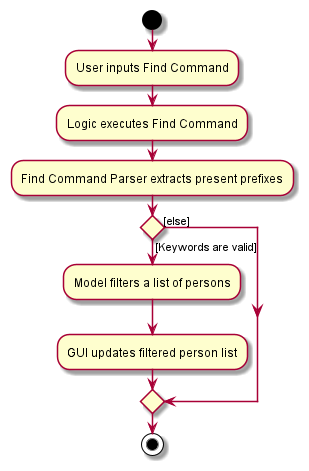
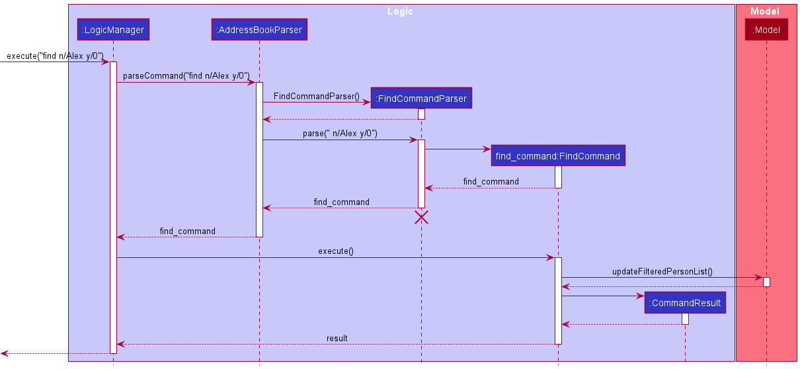
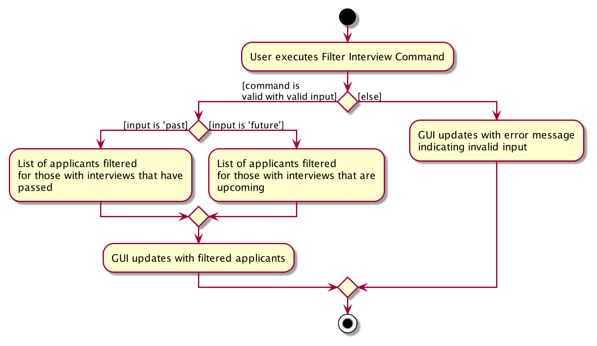
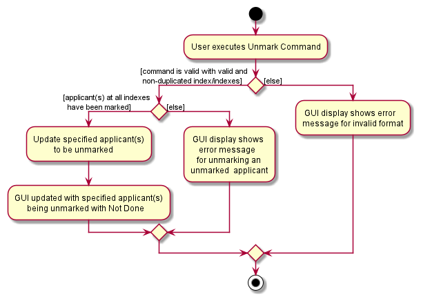
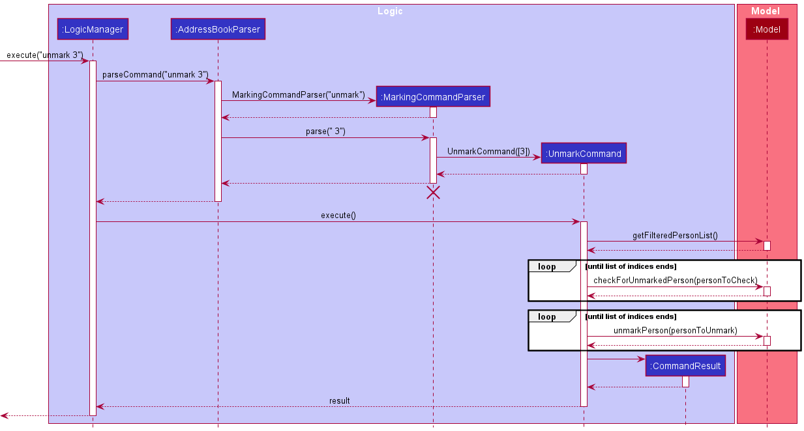

* Table of Contents
  {:toc}

--------------------------------------------------------------------------------------------------------------------

## **Acknowledgements**

* {list here sources of all reused/adapted ideas, code, documentation, and third-party libraries -- include links to the original source as well}

--------------------------------------------------------------------------------------------------------------------

## **Setting up, getting started**

Refer to the guide [_Setting up and getting started_](SettingUp.md).

--------------------------------------------------------------------------------------------------------------------

## **Design**

<div markdown="span" class="alert alert-primary">

:bulb: **Tip:** The `.puml` files used to create diagrams in this document can be found in the [diagrams](https://github.com/se-edu/addressbook-level3/tree/master/docs/diagrams/) folder. Refer to the [_PlantUML Tutorial_ at se-edu/guides](https://se-education.org/guides/tutorials/plantUml.html) to learn how to create and edit diagrams.
</div>

### Architecture


The ***Architecture Diagram*** given above explains the high-level design of the App.

Given below is a quick overview of main components and how they interact with each other.

**Main components of the architecture**

**`Main`** has two classes called [`Main`](https://github.com/se-edu/addressbook-level3/tree/master/src/main/java/seedu/address/Main.java) and [`MainApp`](https://github.com/se-edu/addressbook-level3/tree/master/src/main/java/seedu/address/MainApp.java). It is responsible for,
* At app launch: Initializes the components in the correct sequence, and connects them up with each other.
* At shut down: Shuts down the components and invokes cleanup methods where necessary.

[**`Commons`**](#common-classes) represents a collection of classes used by multiple other components.

The rest of the App consists of four components.

* [**`UI`**](#ui-component): The UI of the App.
* [**`Logic`**](#logic-component): The command executor.
* [**`Model`**](#model-component): Holds the data of the App in memory.
* [**`Storage`**](#storage-component): Reads data from, and writes data to, the hard disk.


**How the architecture components interact with each other**

The *Sequence Diagram* below shows how the components interact with each other for the scenario where the user issues the command `delete 1`.


Each of the four main components (also shown in the diagram above),

* defines its *API* in an `interface` with the same name as the Component.
* implements its functionality using a concrete `{Component Name}Manager` class (which follows the corresponding API `interface` mentioned in the previous point.

For example, the `Logic` component defines its API in the `Logic.java` interface and implements its functionality using the `LogicManager.java` class which follows the `Logic` interface. Other components interact with a given component through its interface rather than the concrete class (reason: to prevent outside component's being coupled to the implementation of a component), as illustrated in the (partial) class diagram below.


The sections below give more details of each component.

### UI component

The **API** of this component is specified in [`Ui.java`](https://github.com/se-edu/addressbook-level3/tree/master/src/main/java/seedu/address/ui/Ui.java)


The UI consists of a `MainWindow` that is made up of parts e.g.`CommandBox`, `ResultDisplay`, `PersonListPanel`, `StatusBarFooter` etc. All these, including the `MainWindow`, inherit from the abstract `UiPart` class which captures the commonalities between classes that represent parts of the visible GUI.

The `UI` component uses the JavaFx UI framework. The layout of these UI parts are defined in matching `.fxml` files that are in the `src/main/resources/view` folder. For example, the layout of the [`MainWindow`](https://github.com/se-edu/addressbook-level3/tree/master/src/main/java/seedu/address/ui/MainWindow.java) is specified in [`MainWindow.fxml`](https://github.com/se-edu/addressbook-level3/tree/master/src/main/resources/view/MainWindow.fxml)

The `UI` component,

* executes user commands using the `Logic` component.
* listens for changes to `Model` data so that the UI can be updated with the modified data.
* keeps a reference to the `Logic` component, because the `UI` relies on the `Logic` to execute commands.
* depends on some classes in the `Model` component, as it displays `Person` object residing in the `Model`.

### Logic component

**API** : [`Logic.java`](https://github.com/se-edu/addressbook-level3/tree/master/src/main/java/seedu/address/logic/Logic.java)

Here's a (partial) class diagram of the `Logic` component:


How the `Logic` component works:
1. When `Logic` is called upon to execute a command, it uses the `AddressBookParser` class to parse the user command.
1. This results in a `Command` object (more precisely, an object of one of its subclasses e.g., `AddCommand`) which is executed by the `LogicManager`.
1. The command can communicate with the `Model` when it is executed (e.g. to add a person).
1. The result of the command execution is encapsulated as a `CommandResult` object which is returned back from `Logic`.

The Sequence Diagram below illustrates the interactions within the `Logic` component for the `execute("delete 1")` API call.


<div markdown="span" class="alert alert-info">:information_source: **Note:** The lifeline for `DeleteCommandParser` should end at the destroy marker (X) but due to a limitation of PlantUML, the lifeline reaches the end of diagram.
</div>

Here are the other classes in `Logic` (omitted from the class diagram above) that are used for parsing a user command:


How the parsing works:
* When called upon to parse a user command, the `AddressBookParser` class creates an `XYZCommandParser` (`XYZ` is a placeholder for the specific command name e.g., `AddCommandParser`) which uses the other classes shown above to parse the user command and create a `XYZCommand` object (e.g., `AddCommand`) which the `AddressBookParser` returns back as a `Command` object.
* All `XYZCommandParser` classes (e.g., `AddCommandParser`, `DeleteCommandParser`, ...) inherit from the `Parser` interface so that they can be treated similarly where possible e.g, during testing.

### Model component
**API** : [`Model.java`](https://github.com/se-edu/addressbook-level3/tree/master/src/main/java/seedu/address/model/Model.java)


The `Model` component,

* stores the address book data i.e., all `Person` objects (which are contained in a `UniquePersonList` object).
* stores the currently 'selected' `Person` objects (e.g., results of a search query) as a separate _filtered_ list which is exposed to outsiders as an unmodifiable `ObservableList<Person>` that can be 'observed' e.g. the UI can be bound to this list so that the UI automatically updates when the data in the list change.
* stores a `UserPref` object that represents the user’s preferences. This is exposed to the outside as a `ReadOnlyUserPref` objects.
* does not depend on any of the other three components (as the `Model` represents data entities of the domain, they should make sense on their own without depending on other components)

<div markdown="span" class="alert alert-info">:information_source: **Note:** An alternative (arguably, a more OOP) model is given below. It has a `Tag` list in the `AddressBook`, which `Person` references. This allows `AddressBook` to only require one `Tag` object per unique tag, instead of each `Person` needing their own `Tag` objects.<br>


</div>


### Storage component

**API** : [`Storage.java`](https://github.com/se-edu/addressbook-level3/tree/master/src/main/java/seedu/address/storage/Storage.java)


The `Storage` component,
* can save both address book data and user preference data in json format, and read them back into corresponding objects.
* inherits from both `AddressBookStorage` and `UserPrefStorage`, which means it can be treated as either one (if only the functionality of only one is needed).
* depends on some classes in the `Model` component (because the `Storage` component's job is to save/retrieve objects that belong to the `Model`)

### Common classes

Classes used by multiple components are in the `seedu.addressbook.commons` package.

--------------------------------------------------------------------------------------------------------------------

## **Implementation**

This section describes some noteworthy details on how certain features are implemented.

### Add feature 

The ```add``` command is facilitated by creating an ```AddCommand``` depending on the given input.
This command then updates the ```model``` accordingly.

The following activity diagram summarizes what happens when a user executes an ```add``` command:


Given below is an example usage scenario and how the add operation behaves at each step.

Step 1. A valid command `add n/Dylan p/97998581 e/dylan.eyyou@gmail.com r/Pilot et/Full time s/3500 l/PhD y/4`
is given as user input. This invokes `LogicManager#execute()`, which calls`AddressBookParser#parseCommand()` to parse
the input into command word `add` and command argument ` n/Dylan p/97998581 e/dylan.eyyou@gmail.com r/Pilot et/Full time s/3500 l/PhD y/4`.

Step 2. `AddCommandParser` is initialized based on the parse results and `AddCommandParser#parse()` is called.
`AddCommandParser#parse()` then calls `ArgumentTokenizer#tokenize()` to obtain an `ArgumentMultimap`, which is
a mapping of all prefixes to their respective arguments (i.e. `n/` to `Dylan`, `p/` to `97998581`, etc). 

Step 3. `AddCommandParser#arePrefixesPresent` is then called to ensure all the mandatory prefixes have been inputted by the user.
After which, `AddCommandParser#parse()` then initializes a new `Person` with all the specified details from the input.

Step 4. `AddCommandParser#parse()` then initializes an `AddCommand` with the new `Person` as an argument. `AddCommand#execute()` 
is then called, which calls `Model#hasPerson()` to ensure that the new `Person` is not a duplicate of any existing applicant in the 
`AddressBook`.

Step 5. `AddCommand#execute()` then calls `Model#addPerson()` to add the new applicant in the `AddressBook`.

Step 6. `CommandResult` is initialized with `String` containing the details of the new applicant.
This CommandResult is then returned.

The following sequence diagram shows how the add operation works.

<div markdown="span" class="alert alert-info">:information_source: **Note:** The lifeline for `AddCommandParser`
should not exceed the destroy marker X. This is a known limitation of PlantUML.</div>

### Delete marked feature

The ```delete_marked``` command is facilitated by creating an ```DeleteMarkedCommand```.
This command then updates the ```model``` accordingly.

The following activity diagram summarizes what happens when a user executes a ```delete_marked``` command:


Given below is an example usage scenario illustrated by a sequence diagram for ```delete_marked``` command.

Step 1. A valid command `delete_marked` is given as user input. This invokes `LogicManager#execute()`, which calls
`AddressBookParser#parseCommand()` to parse `delete_marked`.

Step 2. `AddreddBookParser#parseCommand()` initializes a `DeleteMarkedCommand`.

Step 3. `DeleteMarkedCommand#execute()` is then called, which will in turn call `Model#updateFilteredList()` (not shown) to 
update list for applicants marked then `Model#getFilteredList()` is then called to retrieve this list. 

Step 4. `Model#deletePerson()` is called on applicants in the list to delete them.

Step 5. Once the string of all applicant names that are marked is formed, `CommandResult` is initialized with this string as argument
and returned.

The following sequence diagram shows how the delete marked operation works.


#### Design considerations:

**Aspect: User command to use in deleting marked applicants:**

* **Alternative 1 (current choice):** Separate command for deleting marked applicants
    * Pros: Command has single responsibility of deleting marked applicants based.
    * Pros: Easy to use for user, does not take any additional input.
    * Cons: User might be confused between `delete` command for general deletion and `delete_marked` command.

* **Alternative 2:** Part of `delete` command functionality
    * Pros: Intuitive for user to use `delete` command for all deletion purposes
    * Cons: Breaks the single responsibility principle as deleting marked applicants does not delete applicants at specific indices
    like the rest of the `delete` command, but rather a certain group of applicants at once. 


### Edit feature

The ```edit``` command is facilitated by creating an ```EditCommand``` depending on the given input.
This command then updates the ```model``` accordingly.

The following activity diagram summarizes what happens when a user executes an ```edit``` command:


Given below is an example usage scenario and how the edit operation behaves at each step.

Step 1. A valid command `edit 1 n/Ali` is given as user input. This invokes `LogicManager#execute()`, which calls
`AddressBookParser#parseCommand()` to parse `edit 1 n/Ali` into command word `edit` and command argument ` 1 n/Ali`.

Step 2. `EditCommandParser` is initialized based on the parse results and `EditCommandParser#parse()` is called.
`EditCommandParser#parse()` then calls `ArgumentTokenizer#tokenize()` to identify the `Index` of the person to be 
edited from the preamble of the input (i.e. `1` in this case), as well as obtain an `ArgumentMultimap` of prefixes
to their respective arguments (i.e. mapping `n/` to `Ali`).

Step 3. `EditCommandParser#parse()` then initializes an `EditPersonDescriptor` that stores the details to edit the person with.
Thus, `EditPersonDescriptor#setName()` will be called to store `Ali` as the `Name` to be edited to.

Step 4. `EditCommandParser#parse()` then initializes an `EditCommand` with the `Index` and `EditPersonDescriptor` as an argument.
`EditCommand#execute()` is then called, which creates a new `Person` and copies over the details to be edited
from the `EditPersonDescriptor`.

Step 5. After checking that the new `Person` is not a duplicate of any existing applicant in the `AddressBook` using `Model#hasPerson()`,
`Model#setPerson()` will be called to change the specified applicant in the `AddressBook`. Finally, `Model#updateFilteredPersonList()`
is called to reflect the changes in the list of applicants shown to the user.

Step 6. Once the list is updated, `CommandResult` is initialized with `String` containing the details of the edited applicants.
This CommandResult is then returned.

The following sequence diagram shows how the edit operation works.

<div markdown="span" class="alert alert-info">:information_source: **Note:** The lifeline for `EditCommandParser`
should not exceed the destroy marker X. This is a known limitation of PlantUML.</div>

### Show feature

The ```show``` command is facilitated by creating an ```ObservableList``` of ```Person``` objects from the
```AddressBook```. A ```List``` of unique ```String``` objects is created, with ```String``` content depending on
the prefix provided by the user.

The following activity diagram summarizes what happens when a user executes a ```show``` command:


Given below is an example usage scenario and how the show operation behaves at each step.

Step 1. A valid command `show n/` is given as user input. This invokes `LogicManager#execute()`, which calls
`AddressBookParser#parseCommand()` to parse `show n/` into command word `show` and command argument ` n/`.

Step 2. `ShowCommandParser` is initialized based on the parse results and `ShowCommandParser#parse()` is called
to identify the first prefix in the user input ` n/`. `ShowCommandParser#parse()` then initializes a
`ShowCommand` with the first prefix `Name` as argument.

Step 3. `ShowCommand#execute()` is then called, which will first obtain a `ReadOnlyAddressBook` from `Model`, from which
the `ObservableList<Person>` belonging to the `ReadOnlyAddressBook` is obtained. The names of each applicant within
the `ObservableList<Person>` is then accumulated to form a string of all applicant names.

Step 4. Once the string of all applicant names is formed, `CommandResult` is initialized with this string as argument
and returned.

The following sequence diagram shows how the show operation works.

<div markdown="span" class="alert alert-info">:information_source: **Note:** The lifeline for `ShowCommandParser`
should not exceed the destroy marker X. This is a known limitation of PlantUML.</div>
   
### Find feature

The ```find``` command is facilitated by creating a ```FindCommand``` depending on the given
input. This command then updates the ```model``` accordingly.

The following activity diagram summarizes what happens when a user executes a ```find``` command:



Given below is an example usage scenario illustrated by a sequence diagram for ```find``` command.

Step 1. A valid command `find n/Alex y/0` is given as user input. This invokes `LogicManager#execute()`, which calls
`AddressBookParser#parseCommand()` to parse `find n/Alex y/0` into command word `find` and command argument ` n/Alex y/0`.

Step 2. `FindCommandParser` is initialized based on the parse results and `FindCommandParser#parse()` is called
to identify the predicates present in ` n/Alex y/0`. `FindCommandParser#parse()` then initializes a
`FindCommand` with the predicates as argument.

Step 3. `FindCommand#execute()` is then called, which will in turn call `Model#updateFilteredPersonList()`
and filters for applicants that have `Alex` in their names and `0` year of experience.

Step 4. Once the string of all applicant names is formed, `CommandResult` is initialized with this string as argument
and returned.



<div markdown="span" class="alert alert-info">:information_source:
 **Note:** The lifeline for `FindCommandParser`
should not exceed the destroy marker X. This is a known limitation of PlantUML.</div>

### Filter interview feature

The ```filter_interview``` command is facilitated by extending an abstract ```FilterInterviewCommand``` class, and executing the appropriate 
subclass depending on the given input. This command then updates the ```model``` accordingly. 

The following activity diagram summarizes what happens when a user executes a ```filter_interview``` command:



Given below is an example usage scenario and how the filter interview operation behaves at each step.

Step 1. A valid command `filter_interview past` is given as user input. This invokes `LogicManager#execute()`, which calls
`AddressBookParser#parseCommand()` to parse `filter_interview past` into command word `filter_interview` and command argument ` past`.

Step 2. `FilterInterviewCommandParser` is initialized based on the parse results and `FilterInterviewCommandParser#parse()` is called
to identify the user input ` past`.

Step 3. Upon identifying the user input ` past`, `FilterInterviewCommandParser#parse` will then call methods of the
`ValidFilterInterviewArgs` class from the enum type `ValidFilterInterviewArgs.PAST` instead of `ValidFilterInterviewArgs.FUTURE`.
The details of this step are omitted from the sequence diagram below for brevity.

Step 4. `FilterInterviewCommandParser#parse` calls the method `ValidFilterInterviewArgs#getFilterInterviewCommand()` to obtain
an object of the appropriate subclass of `FilterInterviewCommand`, which in this case is an instance of `FilterInterviewPastCommand`. 
This instance is returned and propagated back to `LogicManager`. 

Step 5. `FilterInterviewPastCommand#execute()` is then called by `LogicManager`, which will in turn call `Model#updateFilteredPersonList()`
and filters for applicants that have interviews that have already passed. 
 
Step 6. Once the list has been filtered, `CommandResult` is initialized with `String` indicating how many applicants
have interviews that have passed. This `CommandResult` is then returned.

The following sequence diagram shows how the filter interview operation works.

<div markdown="span" class="alert alert-info">:information_source:
 **Note:** The lifeline for `FilterInterviewCommandParser`
should not exceed the destroy marker X. This is a known limitation of PlantUML.</div>

#### Design considerations:

**Aspect: User command to use in filtering interviews:**

* **Alternative 1 (current choice):** Separate command for filtering interviews
    * Pros: Command has single responsibility of filtering interviews based on whether they haved passed or are upcoming.
    * Pros: Easy to use for user, only has two inputs it can take.
    * Cons: Harder to implement than adding to `find` command.
    * Cons: User might be confused between `find` command for interviews and `filter_interview` command.

* **Alternative 2:** Part of `find` command functionality
    * Pros: Easy to implement
    * Pros: Intuitive for user to use `find` command to find certain types of interviews (past or future)
    * Cons: Breaks the single responsibility principle as it does not find a specific input for a prefix, but rather
    types of inputs.

### Unmark feature

The ```unmark``` command is facilitated by creating a ```UnmarkCommand```, which is a subclass of 
```MarkingCommand```. This command then updates the ```model``` accordingly, depending on the given input.

The following activity diagram summarizes what happens when a user executes a ```unmark``` command:


Given below is an example usage scenario illustrated by a sequence diagram for ```unmark``` command.

Step 1. A valid command `unmark 3` is given as user input. This invokes `LogicManager#execute()`, which calls
`AddressBookParser#parseCommand()` to parse `unmark 3` into command word `unmark` and command argument ` 3`.

Step 2. `MarkingCommandParser` is initialized based on the parse results and `MarkingCommandParser#parse()` is called
to identify the indices present in ` 3`. `MarkingCommandParser#parse()` then initializes a
`UnmarkCommand` with the indices present as arguments, which in this case is a single index 3.

Step 3. `MarkCommand#execute()` is then called, which will in turn call `Model#checkForUnmarkedPerson()` on the applicants
corresponding to the given indices. If there is no exception thrown, `Model#unmarkPerson()` is called to unmark the applicants corresponding to the given indices.

Step 4. Once the string of all applicant names that are marked is formed, `CommandResult` is initialized with this string as argument
and returned.




### Datetime for interview 

The `Interview` class accepts `yyyy-M-d, H:m` as parsed time format and provides `MMM dd yyyy , HH:mm` as display format.
- `yyyy` : year-of-era in 4 digits, e.g. `2021`
- `M` : month-of-year, e.g. `7`, `07`
- `d` : day-of-month, e.g. `10`
- `H` : hour-of-day (0-23), e.g. `0`
- `m` : minute-of-hour, e.g. `30`

`Interview#isValidInterviewTime` uses `java.time.format.DateTimeFormatter` to generate a formatter using `Interview#PARSE_FORMAT`,
and checks for `DateTimeParseException` when parsing the input with the formatter via `LocalDate#parse()`.

The `display()` method uses `java.text.DateFormat` and returns the formatted time which is displayed GUI.

For example, the add command `add n/John ... i/2021-01-01, 10:30` will add a person John with interview time shown as `Jan 01 2021, 10:30`.

--------------------------------------------------------------------------------------------------------------------

## **Documentation, logging, testing, configuration, dev-ops**

* [Documentation guide](Documentation.md)
* [Testing guide](Testing.md)
* [Logging guide](Logging.md)
* [Configuration guide](Configuration.md)
* [DevOps guide](DevOps.md)

--------------------------------------------------------------------------------------------------------------------

## **Appendix: Requirements**

### Product scope

**Target user profile**:
A recruiter that
* can type fast
* prefers typing to mouse interactions
* prefer desktop apps over other types
* is reasonably comfortable using CLI apps
* has a need to manage a significant number of applications
* works for a company that gets applications for variety of roles
* has a need to filter and categorise applicants by different fields


**Value proposition**:

It can be hard for recruiters to keep track of the plethora of clients with different skill sets, availability
and experience.

This product will make recruiters’ lives easier through categorisation and filter features to easily access candidates
they have in mind. Recruiters can manage contacts faster than a typical mouse/GUI driven app.


### User stories

Priorities: High (must have) - `* * *`, Medium (nice to have) - `* *`, Low (unlikely to have) - `*`

| Priority | As a …​                                    | I want to …​                            | So that I can…​                                                        |
| -------- | ------------------------------------------ | --------------------------------------------- | ------------------------------------------------------------------------- |
| `* * *`  | new user                                   | see usage instructions                        | refer to instructions when I forget how to use the App                    |
| `* * *`  | user                                       | list all applicants                           | keep track of all my applicants                                           |
| `* * *`  | user                                       | add an applicant                              | update my list of applicants with new people                              |
| `* * *`  | user                                       | delete an applicant                           | remove applicants I no longer need                                        |
| `* * *`  | user                                       | edit an applicant's information               | update their information without having to delete and add them again      |
| `* * *`  | user                                       | find applicants by their name                 | locate details of applicants without having to go through the entire list |
| `* * *`  | user                                       | find applicants by their phone number         | locate details of applicants without having to go through the entire list |
| `* * *`  | user                                       | find applicants by their email                | locate details of applicants without having to go through the entire list |
| `* * *`  | user                                       | find applicants by their applied roles        | filter out applicants that match the desired role                        |
| `* * *`  | user                                       | find applicants by their employment type      | filter out applicants that match the desired employment type              |
| `* * *`  | user                                       | find applicants by their expected salary      | filter out applicants that match the desired salary range of the hiring company   |
| `* * *`  | user                                       | find applicants by their level of education   | filter out applicants that match the desired highest level of education   |
| `* * *`  | user                                       | find applicants by their years of experience  | filter out applicants that match the desired years of experience                    |
| `* * *`  | user                                       | find applicants by their tags                 | filter out applicants that match the desired tags                                   |
| `* * *`  | user                                       | find applicants by their interview time       | filter out applicants that match the desired interview times           |
| `* * *`  | user                                       | find applicants by their notes                | filter out applicants that match the desired note                         |
| `* * *`  | user                                       | find applicants by their done status          | filter out applicants that match the desire done status                   |
| `* * *`  | user                                       | mark applicants as "Done"                     | know which applicants I have attended to                                  |
| `* * *`  | user                                       | unmark applicants from "Done" to "Not Done"   | reflect the correct current status I have with the applicant              |
| `* * *`  | user                                       | save applicant data                           | refer to it in the future without having to type in their data again      |
| `* * *`  | user                                       | exit the application                          | so that I can end my session without having to force close the application by clicking the red X at the top right. |
| `* *`    | user                                       | see all names available in the list           | check easily if a certain name is present in the list without having to go through the entire list      |
| `* *`    | user                                       | see all phone numbers available in the list   | check easily if a certain number is present in the list without having to go through the entire list      |
| `* *`    | user                                       | see all emails available in the list          | check easily if a certain email is present in the list without having to go through the entire list      |
| `* *`    | user                                       | see all applied roles available in the list   | check easily if a certain role is present in the list without having to go through the entire list      |
| `* *`    | user                                       | see all employment types available in the list| check easily if a certain employment type is present in the list without having to go through the entire list      |
| `* *`    | user                                       | see all expected salaries available in the list | check easily if a certain expected salary is present in the list without having to go through the entire list      |
| `* *`    | user                                       | see all interview times available in the list | check easily if a certain interview time is present in the list without having to go through the entire list      |
| `* *`    | user                                       | see all tags available in the list | check easily if a certain tag is present in the list without having to go through the entire list      |
| `* *`    | user                                       | delete multiple applicants at once            | so that I can delete applicants more efficiently                          |
| `* *`    | user                                       | delete all applicants that are marked as done | so that I can focus only on applicants that I have not worked on, and easily reduce clutter in the address book |
| `* *`    | user                                       | delete all applicants at once                 | so that I can save time clearing all data without having to manually input every single applicant via a delete command |
| `* *`    | user                                       | find applicants with interviews that have passed | so that I can easily see the applicants with passed interviews and carry out the appropriate operations on them |
| `* *`    | user                                       | find applicants with interviews that are upcoming | so that I can easily see the applicants with upcoming interviews and carry out the appropriate operations on them |

### Use cases

(For all use cases below, the **System** is the `RecruitIn` and the **Actor** is the `user`, unless specified otherwise)

**Use case: UC01 - Asking for help**

**MSS**

1.  User requests for help to use RecruitIn.
2.  RecruitIn informs user on how to access user guide.

    Use case ends.

**Extensions**

* 2a. User cancels request for help.

  Use case ends.

**Use case: UC02 - List all applicants**

**MSS**

1.  User requests to list all applicants.
2.  RecruitIn shows a list of all applicants.

    Use case ends.

**Use case: UC03 - Adding an applicant**

**MSS**

1.  User requests to add an applicant with provided information.
2.  RecruitIn adds the applicant to the storage.

    Use case ends.

**Extensions**

* 1a. The input format is invalid.
    * 1a1. RecruitIn shows an error message.

      Use case resumes at step 1.
    
* 1b. The applicant that the user is trying to add is a duplicate of an applicant that already exists in the storage.
    * 1b1. RecruitIn shows an error message.
    
      Use case resumes at step 1.
    
**Use case: UC04 - Editing an applicant**

**MSS**

1.  User requests to edit an applicant with provided information.
2.  RecruitIn edits the applicant in the storage.

    Use case ends.

**Extensions**

* 1a. The input format is invalid.
    * 1a1. RecruitIn shows an error message.

      Use case resumes at step 1.

* 1b. The newly edited applicant is a duplicate of an applicant that already exists in the storage.
    * 1b1. RecruitIn shows an error message.

      Use case resumes at step 1.

**Use case: UC05 - Deleting an applicant**

**MSS**

1.  User requests to <u>list applicants (UC01)</u>.
2.  RecruitIn displays a list of applicants.
3.  User requests to delete applicant(s) in the displayed list.
4.  RecruitIn deletes the applicant(s).

    Use case ends.

**Extensions**

* 1a. User requests to <u>find applicant (UC06)</u>.

  Use case resumes at step 2.

* 2a. The list of applicants is empty.

  Use case ends.

* 3a. The delete command is invalid.
    * 3a1. RecruitIn shows an error message.

      Use case resumes at step 2.

**Use case: UC06 - Finding an applicant**

**MSS**

1.  User requests to find an applicant with the provided information.
2.  RecruitIn displays the applicants that match the provided information.

    Use case ends.

**Extensions**

* 1a. The input format is invalid.
    * 1a1. RecruitIn shows an error message.

      Use case resumes at step 1.

* 2a. The list of applicants is empty.

  Use case ends.

**Use case: UC07 - Filtering applicants by passed interviews**

**MSS**

1.  User requests to <u>list applicants (UC01)</u>.
2.  RecruitIn displays a list of applicants.
3.  User requests to find all applicants with interviews that have already passed.
4.  RecruitIn displays the applicants with interviews that have already passed.

    Use case ends.

**Extensions**

* 1a. User requests to <u>find applicant (UC06)</u>.

  Use case resumes at step 2.

* 2a. The list of applicants is empty.

  Use case ends.

* 3a. The command for filtering by passed interviews is invalid.
    * 3a1. RecruitIn shows an error message.

      Use case resumes at step 2.

**Use case: UC08 - Filtering applicants by upcoming interviews**

**MSS**

1.  User requests to <u>list applicants (UC01)</u>.
2.  RecruitIn displays a list of applicants.
3.  User requests to find all applicants with upcoming interviews in the future.
4.  RecruitIn displays the applicants with upcoming interviews in the future.

    Use case ends.

**Extensions**

* 1a. User requests to <u>find applicant (UC06)</u>.

  Use case resumes at step 2.

* 2a. The list of applicants is empty.

  Use case ends.

* 3a. The command for filtering by upcoming interviews is invalid.
    * 3a1. RecruitIn shows an error message.

      Use case resumes at step 2.

**Use case: UC09 - Showing search terms**

**MSS**

1. User requests to show search terms for a specific category.
2. RecruitIn displays a list of search terms for the requested category.

   Use case ends.

**Extensions**

* 1a. The input format is invalid.
    * 1a1. RecruitIn shows an error message.

      Use case resumes at step 1.

* 2a. The list of applicants is empty.

    * 2a1. RecruitIn displays a message indicating that no search terms are available.

      Use case ends.

**Use case: UC010 - Marking an applicant**

**MSS**

1.  User requests to <u>list applicants (UC01)</u>.
2.  RecruitIn displays a list of applicants.
3.  User requests to mark applicant(s) in the displayed list.
4.  RecruitIn marks the requested applicant(s) to "Done".

    Use case ends.

**Extensions**

* 1a. User requests to <u>find applicant (UC06)</u>.

  Use case resumes at step 2.

* 2a. The list of applicants is empty.

  Use case ends.

* 3a. The mark command is invalid.
    * 3a1. RecruitIn shows an error message.

      Use case resumes at step 2.

**Use case: UC11 - Unmarking an applicant**

**MSS**

1.  User requests to <u>list applicants (UC01)</u>.
2.  RecruitIn displays a list of applicants.
3.  User requests to unmark applicant(s) in the displayed list.
4.  RecruitIn unmarks the requested applicant(s) to "Not Done".

    Use case ends.

**Extensions**

* 1a. User requests to <u>find applicant (UC06)</u>.

  Use case resumes at step 2.

* 2a. The list of applicants is empty.

  Use case ends.

* 3a. The unmark command is invalid.
    * 3a1. RecruitIn shows an error message.

      Use case resumes at step 2.

**Use case: UC012 - Deleting marked applicants**

**MSS**

1.  User requests to <u>list applicants (UC01)</u>.
2.  RecruitIn displays a list of applicants.
3.  User requests to delete all applicants marked as "Done".
4.  RecruitIn deletes all applicants marked as "Done".

    Use case ends.

**Extensions**

* 1a. User requests to <u>find applicant (UC06)</u>.

  Use case resumes at step 2.

* 2a. The list of applicants is empty.

  Use case ends.

* 3a. The delete command is invalid.
    * 3a1. RecruitIn shows an error message.

      Use case resumes at step 2.

* 3b. There are no applicants marked as "Done".
    * 3b1. RecruitIn informs the user that no applicants were marked as "Done", and thus no applicants were deleted.

  Use case ends.

**Use case: UC013 - Deleting all applicants at once**

**MSS**

1.  User requests to <u>list applicants (UC01)</u>.
2.  RecruitIn displays a list of applicants.
3.  User requests to delete all applicants at once.
4.  RecruitIn deletes all applicants saved in RecruitIn.

    Use case ends.

**Extensions**

* 1a. User requests to <u>find applicant (UC06)</u>.

  Use case resumes at step 2.

* 2a. The list of applicants is empty.

  Use case ends.

* 3a. The command to delete all applicants is invalid.
    * 3a1. RecruitIn shows an error message.

      Use case resumes at step 2.

**Use case: UC013 - Exiting RecruitIn**

**MSS**

1.  User requests to exit RecruitIn.
2.  RecruitIn closes.

    Use case ends.

**Extensions**

* 1a. The exit command is invalid.
    * 1a1. RecruitIn shows an error message.

      Use case resumes at step 2.

### Non-Functional Requirements

1.  Should work on any _mainstream OS_ as long as it has Java `11` or above installed.
2.  Should be able to hold up to 1000 persons without a noticeable sluggishness in performance for typical usage.
3.  A user with above average typing speed for regular English text (i.e. not code, not system admin commands) should be able to accomplish most of the tasks faster using commands than using the mouse.

### Glossary

* **Mainstream OS**: Windows, Linux, Unix, OS-X
* **Applicant**: Represents a person that is searching for a job
* **Applied Role**: Represents the job a person is applying for
* **Employment Type**: Represents the type of work contract, specifically Full time, Part time, Temporary & Internship
* **Expected Salary**: Represents the minimum amount the applicant is willing to be paid for the job
* **Level of Education**: Represents the highest/current level of education the applicant has, specifically Elementary, Middle School, High School, University, Bachelors, Masters, PhD
* **Years of Experience**: Represents the number of years the applicant has previously worked in their applied role for
* **Search term**: Terms that can be searched for. e.g. Search terms for roles are all the roles that exist in the list, meaning these are all the roles that can be searched for.
--------------------------------------------------------------------------------------------------------------------

## **Appendix: Instructions for manual testing**

Given below are instructions to test the app manually.

<div markdown="span" class="alert alert-info">:information_source: **Note:** These instructions only provide a starting point for testers to work on;
testers are expected to do more *exploratory* testing.

</div>

### Launch and shutdown

1. Initial launch

    1. Download the jar file and copy into an empty folder

    1. Double-click the jar file Expected: Shows the GUI with a set of sample contacts. The window size may not be optimum.

1. Saving window preferences

    1. Resize the window to an optimum size. Move the window to a different location. Close the window.

    1. Re-launch the app by double-clicking the jar file.<br>
       Expected: The most recent window size and location is retained.

1. _{ more test cases …​ }_

### Deleting a person

1. Deleting a person while all persons are being shown

    1. Prerequisites: List all persons using the `list` command. Multiple persons in the list.

    1. Test case: `delete 1`<br>
       Expected: First contact is deleted from the list. Details of the deleted contact shown in the status message. Timestamp in the status bar is updated.

    1. Test case: `delete 0`<br>
       Expected: No person is deleted. Error details shown in the status message. Status bar remains the same.

    1. Other incorrect delete commands to try: `delete`, `delete x`, `...` (where x is larger than the list size)<br>
       Expected: Similar to previous.

1. _{ more test cases …​ }_

### Saving data

1. Dealing with missing/corrupted data files

    1. _{explain how to simulate a missing/corrupted file, and the expected behavior}_

1. _{ more test cases …​ }_
